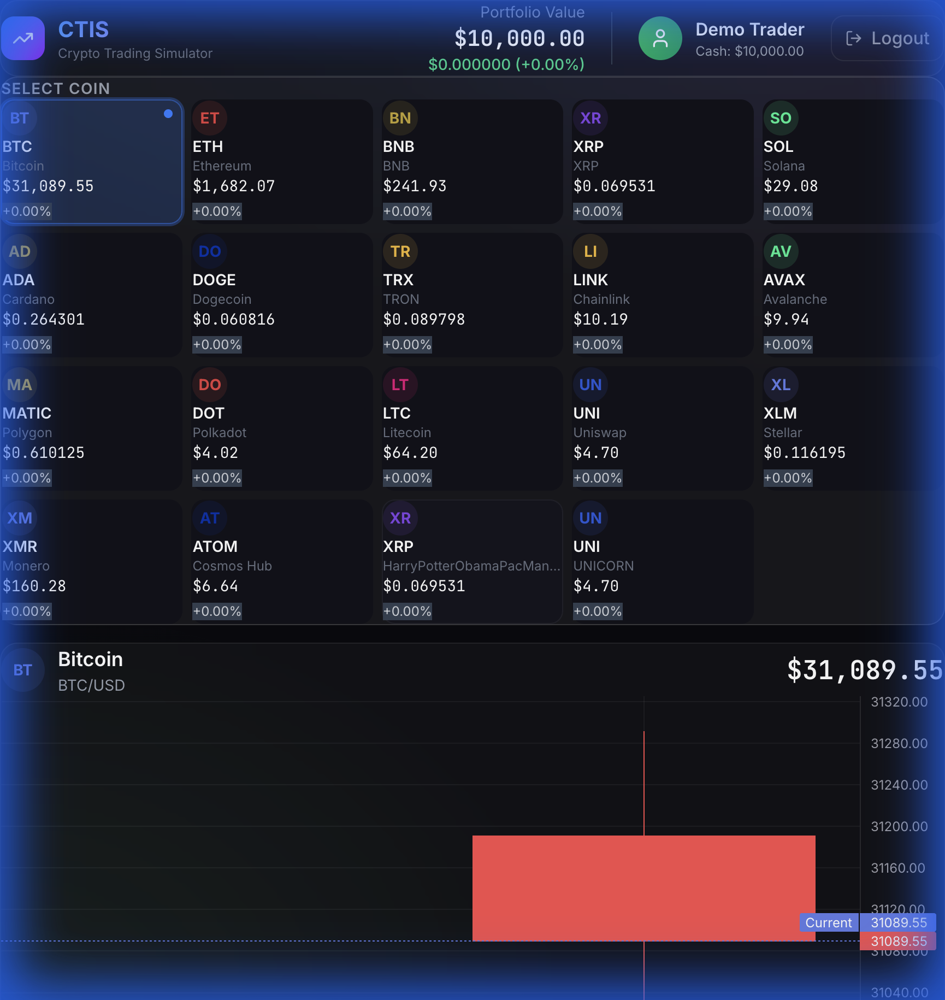

# CTIS v2 - Crypto Trading Information System

A modern crypto trading simulator built with React, TypeScript, and Tailwind CSS. Practice trading with synthetic historical data and track your portfolio performance.



## Features

- **Premium Dark UI** - Glassmorphism design with smooth animations
- **Professional Charts** - Candlestick charts powered by Lightweight Charts (TradingView)
- **Portfolio Management** - Track holdings, P&L, and total value
- **Trading Simulation** - Buy/sell crypto with realistic price movements
- **Day-by-Day Simulation** - Progress through 30 days of market data
- **Multi-Profile Support** - Create and manage multiple trading profiles
- **Persistent State** - Your data is saved to localStorage

## Quick Start

```bash
# Install dependencies
npm install

# Start development server
npm run dev
```

Open [http://localhost:5173](http://localhost:5173) in your browser.

## Tech Stack

| Category | Technology |
|----------|------------|
| Framework | React 18 + Vite |
| Language | TypeScript |
| Styling | Tailwind CSS v4 |
| State | Zustand |
| Charts | Lightweight Charts |
| CSV Parsing | PapaParse |
| Icons | Lucide React |

## Project Structure

```
├── public/
│   ├── coins/              # Coin icon assets
│   └── data/               # CSV market data
├── src/
│   ├── components/         # React components
│   ├── stores/             # Zustand state management
│   ├── services/           # Data parsing & utilities
│   ├── types/              # TypeScript interfaces
│   └── utils/              # Helper functions
└── package.json
```

## Data Source

The app uses a [cryptocurrency snapshot dataset](https://www.kaggle.com/datasets/mmohaiminulislam/crypto-currency-datasets) from Kaggle. Historical price data is synthetically generated using percentage change columns to create realistic 30-day price movements for the simulation.

## How to Use

1. **Create a Profile** - Enter your name to start with $10,000 in virtual cash
2. **Select a Coin** - Click on any cryptocurrency from the grid
3. **View the Chart** - Watch price movements with professional candlestick charts
4. **Trade** - Enter an amount and click Buy or Sell
5. **Simulate Time** - Use the controls to advance day-by-day or auto-play
6. **Track Performance** - Monitor your portfolio value and P&L in real-time

## Available Scripts

| Command | Description |
|---------|-------------|
| `npm run dev` | Start development server |
| `npm run build` | Build for production |
| `npm run preview` | Preview production build |
| `npm run lint` | Run ESLint |

## License

MIT
